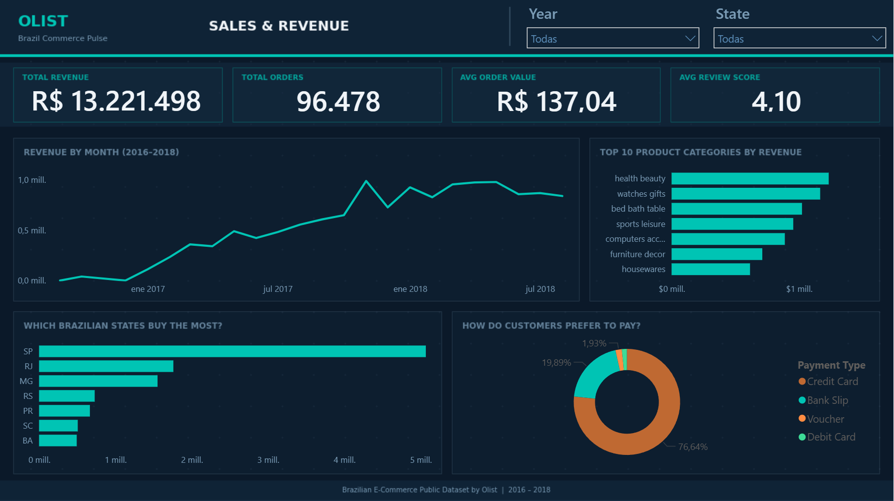
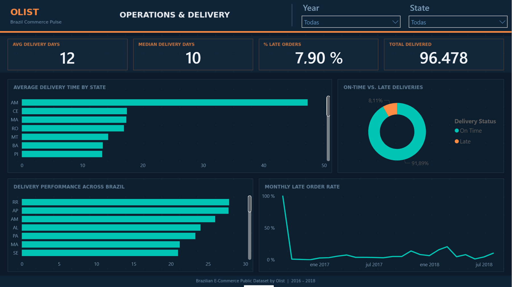
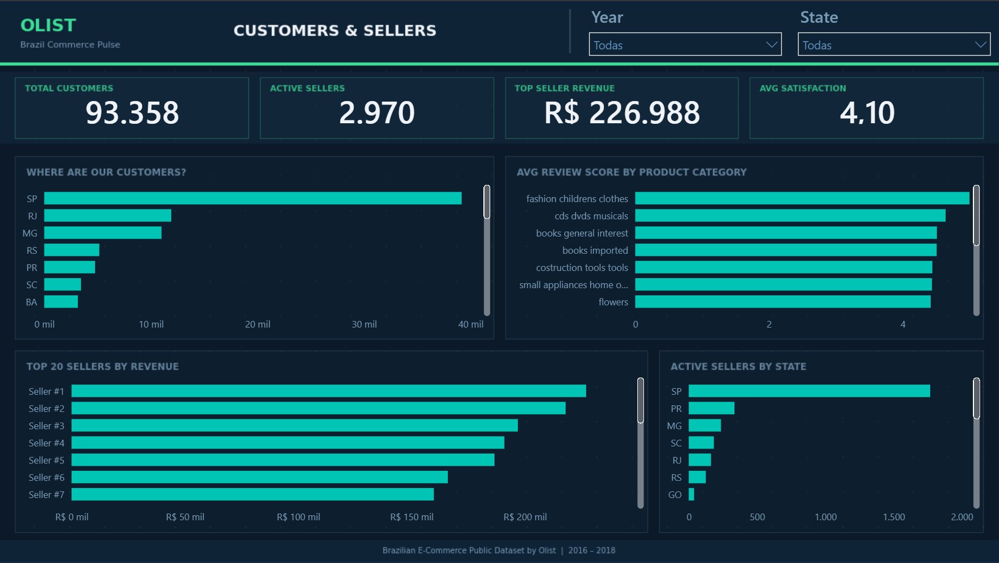
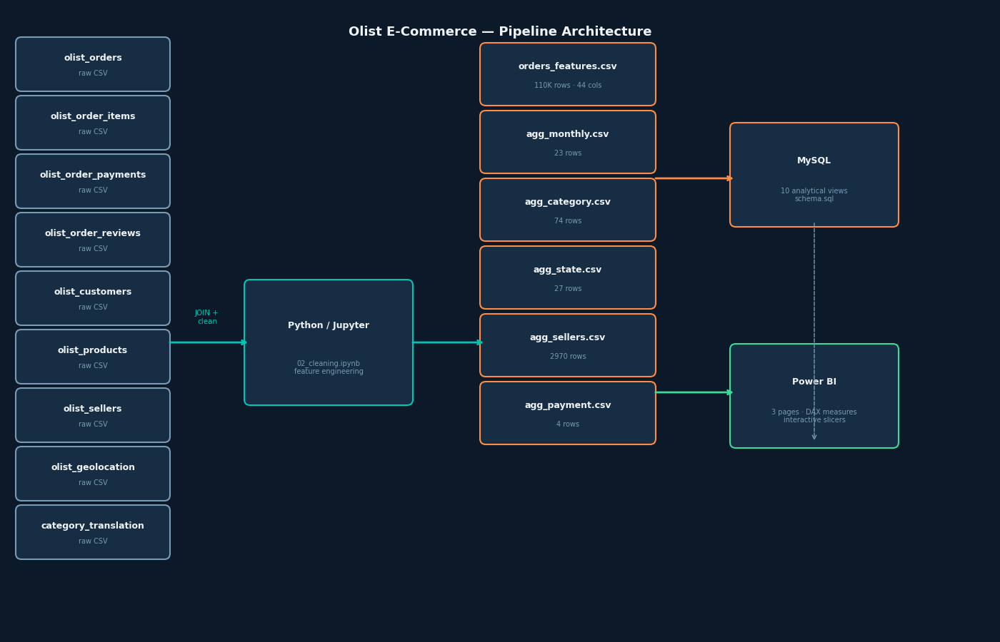

# Olist E-Commerce Analysis — Brazil Commerce Pulse

End-to-end sales analysis of the Brazilian E-Commerce Public Dataset by Olist (2016–2018).  
Full pipeline: data cleaning in Python → business metrics in SQL → interactive dashboard in Power BI.

**[View Live Dashboard →](https://app.powerbi.com/view?r=eyJrIjoiYTE4OTk0NWQtNzM4Yy00M2IxLTkwYWQtOTA0MWU5YjY4MDc0IiwidCI6ImIwNzdiNmU1LWQyYWEtNDRhNS1hNGI2LTIxMmVmMWMwMTEwMSJ9)**

---

## Dashboard

### Page 1 — Sales & Revenue


### Page 2 — Operations & Delivery


### Page 3 — Customers & Sellers


---

## Key Findings

**Sales**
- **R$ 13.2M** in total revenue across 96,478 orders (2016–2018)
- Average order value of **R$ 137** — consistent across the full period
- Revenue grew steadily from near zero in late 2016 to over **R$ 1M/month** by mid-2018
- **Health & Beauty** is the top revenue category, followed by Watches & Gifts and Bed/Bath/Table

**Geography**
- **São Paulo** accounts for the largest share of both customers (~40K) and revenue (~R$ 5M)
- SP, RJ, and MG together represent over 60% of all orders

**Operations**
- Average delivery time: **12 days** (median: 10 days)
- **7.9% of orders** arrived late — concentrated in remote northern states
- **Amazonas (AM)** has the highest average delivery time at ~48 days
- Late order rate stabilized around 8–10% after an initial spike in 2016

**Payments**
- **76.6% of orders** paid by credit card
- Bank slip (boleto) accounts for 19.9% — relevant for Brazil's unbanked population

**Sellers**
- **2,970 active sellers** on the platform
- Top seller generated **R$ 226,988** in revenue
- Seller base concentrated in SP (2,000+), with PR and MG as secondary hubs

---

## Pipeline Architecture



---

## Tech Stack

| Layer | Tools |
|-------|-------|
| Data Cleaning | Python · Pandas |
| Exploratory Analysis | Jupyter Notebooks · Matplotlib · Seaborn |
| Business Metrics | SQL · MySQL |
| Dashboard | Power BI Desktop · DAX |

---

## Project Structure

```
├── data/
│   ├── raw/          # Original Kaggle CSVs (9 tables)
│   └── processed/    # Intermediate outputs
├── notebooks/
│   ├── 01_EDA.ipynb
│   ├── 02_cleaning.ipynb
│   └── 03_analysis.ipynb
├── exports/          # Clean CSVs consumed by Power BI and SQL
├── sql/
│   ├── schema.sql
│   └── analysis_queries.sql
├── powerbi/
│   ├── theme_olist.json
│   └── generate_backgrounds.py
└── visuals/          # Dashboard screenshots
```

---

## Dataset

**Brazilian E-Commerce Public Dataset by Olist** — available on [Kaggle](https://www.kaggle.com/datasets/olistbr/brazilian-ecommerce).  
100K+ orders from 2016 to 2018 across 9 relational tables.

---

## How to Run

```bash
# 1. Set up environment
python -m venv .venv
source .venv/Scripts/activate
pip install -r requirements.txt

# 2. Run notebooks in order
jupyter lab
# 01_EDA.ipynb → 02_cleaning.ipynb → 03_analysis.ipynb

# 3. Load to MySQL
python sql/load_to_mysql.py

# 4. Generate Power BI backgrounds
python powerbi/generate_backgrounds.py
```
